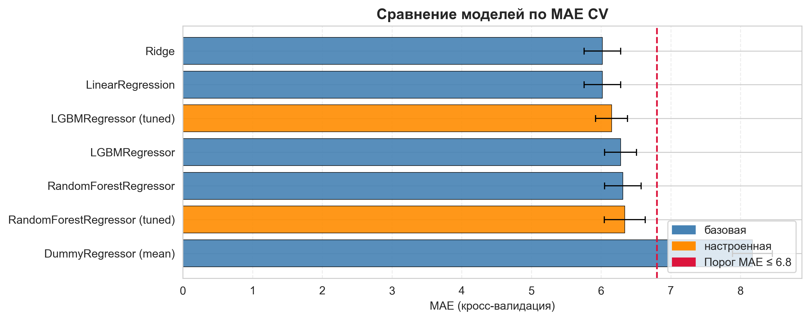
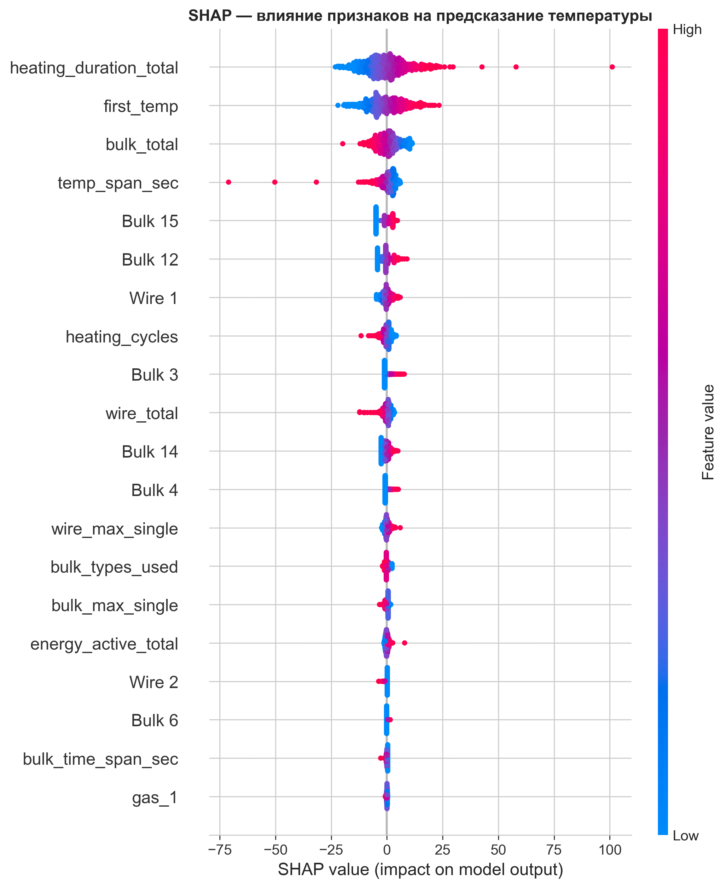
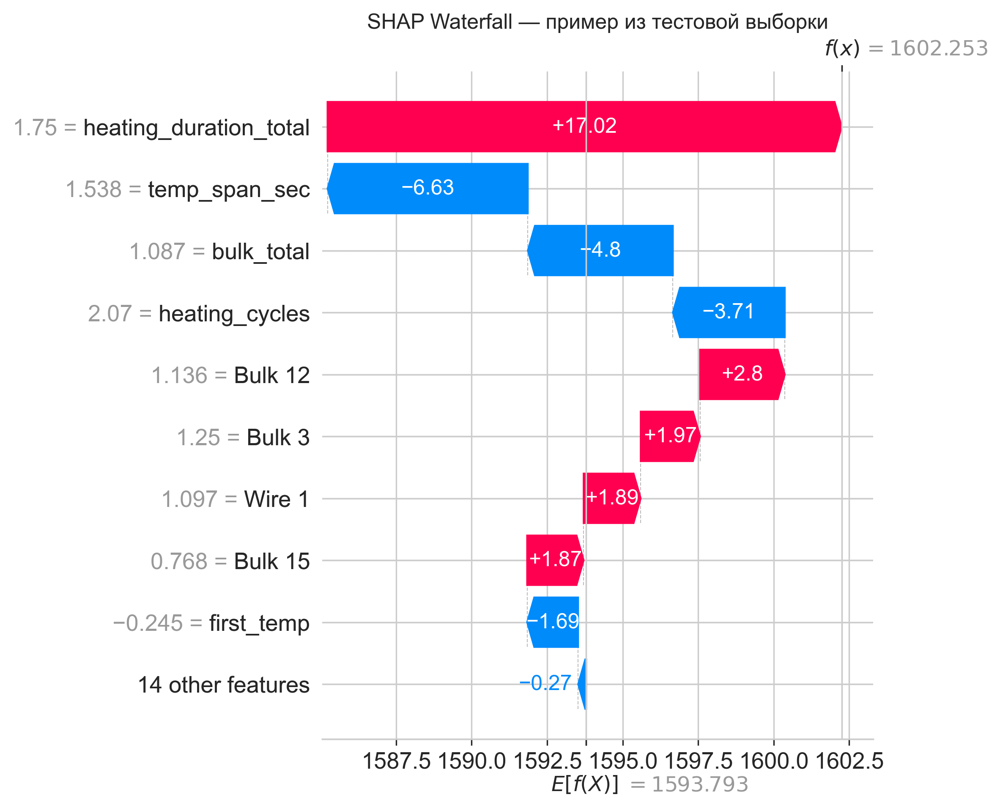

# 🏭 Прогнозирование температуры стали

Промышленный ML-проект: модель предсказывает финальную температуру сплава при обработке стали, чтобы металлургический комбинат мог оптимизировать энергопотребление.

**Результат: MAE = 6.00 °C на тестовой выборке при требуемом пороге ≤ 6.8 °C**, устойчивость результата подтверждена статистически (bootstrap, критерий Уилкоксона), модель интерпретирована через SHAP.



## 📋 Задача

Металлургический комбинат хочет снизить расходы на электроэнергию на этапе обработки стали. Сталь подогревают в ковше графитовыми электродами, между циклами нагрева корректируют химический состав, добавляют легирующие материалы и продувают сплав инертным газом. Модель, предсказывающая финальную температуру по параметрам процесса, позволяет имитировать техпроцесс и точнее управлять нагревом — то есть не тратить лишнюю энергию.

## 📊 Данные

Семь таблиц из разных источников с событийной структурой (одной партии соответствует несколько записей): данные об электродах (мощность, время нагрева), подача сыпучих и проволочных материалов (объёмы и время), продувка газом, замеры температуры.

Ключевые решения при подготовке:
- пропуски в материалах интерпретированы как отсутствие подачи, а не как потерянные данные;
- в выборку вошли только партии с ≥ 2 валидными замерами температуры; целевая переменная — последний замер партии;
- удалены физически нереалистичные значения температуры и аномалии мощности.

## 🔧 Признаки

Событийные данные агрегированы до уровня партии: длительность и число циклов нагрева, суммарная энергия обработки, объёмы и число типов материалов, временные интервалы подачи, начальная температура (`first_temp`). Разреженные и дублирующие признаки исключены по результатам корреляционного анализа.

## 🤖 Модели

Сравнение по MAE на 5-кратной кросс-валидации; для ансамблей выполнен подбор гиперпараметров с повторной оценкой на полном train. Тестовая выборка использована **один раз** — для финальной проверки выбранной модели.

| Модель | MAE (CV) |
| --- | --- |
| **Ridge** | **6.01** |
| LGBMRegressor (tuned) | 6.19 |
| RandomForestRegressor (tuned) | 6.35 |
| DummyRegressor (baseline) | 8.17 |

**Финальный результат Ridge: MAE test = 6.00 °C** — близость к MAE CV (6.01) говорит об отсутствии переобучения.

## 🔎 Интерпретация: SHAP

Для выбранной модели выполнен SHAP-анализ: не только *какие* параметры техпроцесса влияют на прогноз, но и *в какую сторону*.



Наибольший вклад вносят **длительность нагрева** (`heating_duration_total`), **начальная температура** (`first_temp`), **суммарный объём сыпучих материалов** (`bulk_total`) и длительность обработки — что согласуется с физикой процесса: итоговая температура зависит от исходного состояния партии и интенсивности нагрева. Более высокие значения длительности нагрева и начальной температуры сдвигают прогноз вверх; влияние объёма материалов — нелинейное. Отдельные добавки (`Bulk 15`, `Wire 1` и др.) также вносят заметный вклад: модель учитывает не только режим нагрева, но и состав.

Waterfall-график показывает, как складывается прогноз для конкретной партии — объяснимость на уровне отдельного предсказания:



## 📐 Статистическая проверка результата

- **Bootstrap (n = 1000)**: 95%-й доверительный интервал тестового MAE полностью лежит ниже порога 6.8 °C;
- **Критерий Уилкоксона** по фолдам кросс-валидации: преимущество модели над baseline статистически значимо, а не случайно.

Итог: побеждает регуляризованная линейная модель — лучшее сочетание качества, устойчивости и интерпретируемости для данной задачи.

## 💼 Рекомендации заказчику

1. **Контролировать начальную температуру партии** — `first_temp` один из важнейших признаков (подтверждено и коэффициентами Ridge, и SHAP): её стабильность напрямую улучшает управляемость нагрева.
2. **Использовать модель для настройки режима нагрева** — вклад признаков длительности и энергии обработки означает, что модель помогает подбирать режим электродов и срезать избыточные энергозатраты.
3. **Применять модель для сценарного анализа** — оценивать финальную температуру до запуска обработки при разных параметрах процесса.

## 🛠 Стек

`Python` · `pandas` · `NumPy` · `scikit-learn` · `LightGBM` · `SHAP` · `SciPy` · `Matplotlib` · `Seaborn` · `Jupyter`

## 🚀 Как запустить

```bash
git clone https://github.com/foxypandas/steel-temperature-prediction.git
cd steel-temperature-prediction
pip install -r requirements.txt
jupyter notebook notebooks/steel_temperature_prediction.ipynb
```

Датасеты предоставлялись в рамках образовательной программы Яндекс Практикума и не распространяются публично, поэтому в репозиторий не включены. Все выводы ячеек сохранены в ноутбуке — анализ можно посмотреть целиком без запуска кода.

## 📁 Структура проекта

```
├── notebooks/     # основной ноутбук с исследованием
├── images/        # графики и визуализации
└── requirements.txt
```
